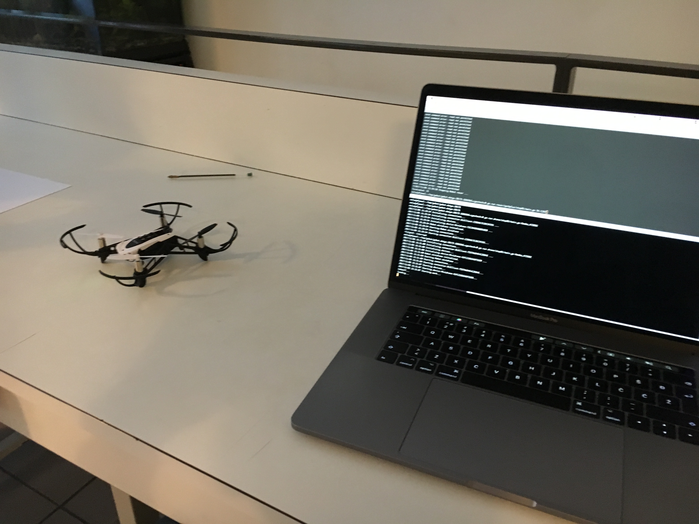

# Konferencija dotGo 2017, Pariz

O konferenciji sam ranije napisao članak za [netokraciju](http://www.netokracija.com/dotgo-pariz-2017-142953). Tamo sam više pisao o formi, ovdje ću više o sadržaju.

## Gobot workshop

Na [workshopu](https://www.meetup.com/Golang-Paris/events/244553942/) je sudjelovalo 20tak ljudi. Atmosfera gotovo identična Golang meetupima u Zagrebu. Tema workshopa je bila [gobot](https://gobot.io/) paket koji omogućava komunikaciju sa mnoštovom remote uređaja koristeći Go. Workshop je vodio [Ron Evans](https://twitter.com/deadprogram), jedan od autora paketa.

## Gathering of International Gophers

Klasični meetup, 6 predavanja. Snimke ovih predavanja **neće** biti dostupne online.

### Mainflux: IoT platform written in Go - Draško Drašković

Predstavio je platformu za mikroservise koju su napravili. Ključne riječi: [gokit](https://github.com/go-kit/kit), [MQTT](http://mqtt.org/), [CoAP](http://coap.technology/), [NATS](https://nats.io/), [SenML](https://tools.ietf.org/html/draft-jennings-senml-10), Cassandra, Docker, Kubernetes.

### CGo: When and when not to use it - Karl Matthias

Osvrt na neke pitfalle kada se koristi [CGo](https://golang.org/cmd/cgo/). Ako je vjerovati predavaču CGo nije baš lako obuzdati. Fotografija na kojoj je side sa popisom najvećih concerna:

### Performance profiling in golang - Thomas Solignac

Solidno predavanje o dobro poznatom [pprof](https://golang.org/pkg/net/http/pprof/) paketu.

### Unseen hero of modern compilers - Olivier Cano

Teoretska priča o optimizacijama u Go compileru i SSA formi.

### Dynaroutes - Pietro de Salvia

Pietru se svidio dynamic routing kakvog ima [Netflixov Zuul](https://github.com/Netflix/zuul). Točnije, sviđa mu se mogućnost konfiguracije bez restartanja servisa. Zato je napravio svoj proxy u kojem se koristi Golang za pisanje routing pravila. Pravila se mogu mijenjati bez reloadanja. 

Kasnije sam malo popričao s njim; proizvod je još miljama daleko od ozbiljnije produkcije. Samo eksperiment.

### Goland IDE, JetBrains - Florin Patan

[Komercijalni IDE](https://www.jetbrains.com/go/). Predstavili su dosta featurea. Zapele su mi za oko opcije find type which implements interface i obrnuto koje VS Code nema. Sutradan su na main eventu također imali štand.

Inače, predavači na main tracku su gotovo isključivo koristili [VS Code](https://code.visualstudio.com/). Uključujući Campoya.

## Afterparty

## Konferencija

Zasad su dostupni [video zapisi](https://www.dotconferences.com/conference/dotgo-2017) tri predavanja. Ubrzo se očekuju i ostala predavanja.

### Simulating a real-world system in Go - Sameer Ajmani

Sameer je manager Go teama. Pokušao je objasniti concurrency u Golangu usporedbom sa stvarim svijetom. Gorutine, mutexi, kanali, buffered kanali. Izmjerio je koliko sve od toga zasebno donosi poboljšanja i koji su limiti. Pokazao je primjere i dao [source kod](https://github.com/Sajmani/dotgo/blob/master/coffee) za igranje. Ponajbolje predavanje.

### Go Lift - John Cinnamond

John se nadovezuje na [blog post](https://blog.golang.org/errors-are-values) Rob Pikea o hendlanju grešaka. Opisuje simpatičan primjer organizacije koda tako da se error provjeri samo jedanom na kraju funkcije. Da, problem je stvaran.

### The art of testing - Matt Ryer

Autor paketa [testify](https://github.com/stretchr/testify) i knjige [Go Programming Blueprints](https://github.com/matryer/goblueprints) opisuje neke općenite principe zašto i kako testirati kod. Preporuča nam paket [moq](https://github.com/matryer/moq) za automatsko generiranje mockanih interfacea za testove i [httptest](https://golang.org/pkg/net/http/httptest/) za testiranje REST apia.

### Behavior Of Channels - William Kennedy

Autor knjige [Go in action](https://www.manning.com/books/go-in-action) se profesionalno bavi Go trainingom ([1](https://github.com/ardanlabs/gotraining), [2](https://www.goinggo.net/)). Na predavanju je ispričao priču kako mu je jednom nemogućnost pisanja u log zaustavila produkciju. I kako je to onda vješto spriječio dropanjem log zapisa pomoću select naredbe. U stotinjak linija koda je lijepo iskoristio nekoliko dobrih Go patterna.

### Functional design in Go - Sam Boyer

Sam Boyer je maintainer [dep](https://github.com/golang/dep)-a. Ispričao je kako je koristio memoizaciju za ubrzanje dep-a. Od više ljudi na konferenciji sam čuo da koriste dep za dependency management.

### Runtime scheduler - Jaana B. Dogan

Jaana je Software developer at Google. Pričala je o detaljima runtime schedulera za Go. Preslikavanje gorutina na sistemske threadove M:N.

### Networking in Go - Cindy Sridharan

Cindy objašnjava kako je implementiran networking stack u Gou. Krene od *http.ListenAndServe* pa do dođe do sistemskih file deskriptora. Ideja dobra, preznetacija konfuzna.

### Debuggers from scratch - Liz Rice

Liz je autor knjige [How to containerize your Go code](https://www.safaribooksonline.com/library/view/how-to-containerize/9781491982310/). Objasnila je kako koristiti ptrace i [gosym](https://golang.org/pkg/debug/gosym/) paket za napraviti vlastiti Go debugger. Spusti se u assembler i zamjeni željenu assembler naredbu sa breakpointom.

### Machine Learning in Go - Francesc Campoy

Moj omiljeni [youtuber](https://www.youtube.com/channel/UC_BzFbxG2za3bp5NRRRXJSw) objašnjava zašto Go nije top izbor za machine learning. Uzeo je jedan basic primjer (linear regression) i isprobao nešto napraviti pomoću [gonum](https://github.com/gonum) paketa. Onda pogledao u svoj kod i nije bio sretan.

### Go in enterprise applications - Brian Ketelsen

Može li Go u tom segmentu konkurirati postojećim .NET ili  Java frameworcima? Može u performansama, skalabilnosti i robustnosti. Problemi su u sučeljima prema enterprise alatima, sa centraliziranim upravljanjem aplikacijom te sa premalo Go frameworka i ekosustava.

## Lightning talks

**Daniel Marti** opisuje kako je napisao program za [reduciranje](https://github.com/mvdan/goreduce) go koda. Smith (random generator koda) i reduce (skraćivač koda) se koriste za intenzivnije testiranje Go compilera. Po uzoru na [csmith](https://github.com/csmith-project/csmith) i [creduce](https://github.com/csmith-project/creduce).

**Jaime Silvela** nam kaže da možemo odmah poslati response na web request (korisnik vidi da je uspješno submitao), odraditi posao u gorutini i onda vratiti rezultat. Da korisnik ne čeka predugo. (Ovo mislim da je doista basic)

**Fabio Raposelli** je napisao [alat](https://github.com/frapposelli/wwhrd) za provjeru licenci programa. Prođe kroz sve dependencie i njihove licence pa provjeri zadovoljavaju li zadana poslovna pravila (whitelist, blacklist).

**Pascal Constanza** je uspješno iskoristio Go za [DNA sekvenciranje](https://github.com/ExaScience/elprep).

**Massimiliano Pippi** iz [data doga](https://www.datadoghq.com/) (real-time performance monitoring) priča o problemima embedanja Pythona u Go.

**Ron Evans** je predstavio Go [paket](https://github.com/hybridgroup/gocv) za computer vision. Wrapper za OpenCV 3.3+. Domena uključuje tracking faces, recognize people, autonomuos vehicles, augmented people...

**Laurent Leveque** priča o exposeanju Go za Andriod i Python.

**Diana Ortega** priča o inicijativi za Go [deep learning](http://gopherdata.io/).

**Marcel van Lohuizen** priča o hendlanju errora u Golangu (deja vu).

**Blake Mizerany**, koji je inače bio i MC konferencije, predstavlja svoju platformu [backplane.io](https://www.backplane.io/). Upravo su dobili investiciju. Backplane is a managed service that unifies discovery, routing, and load balancing for web servers written in any language, running in any cloud or datacenter.

