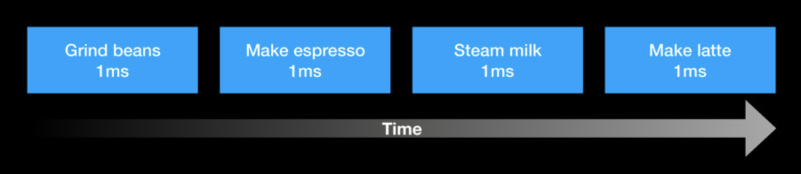
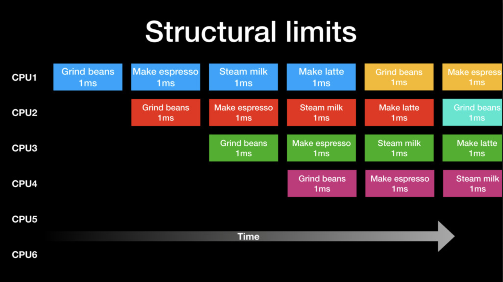
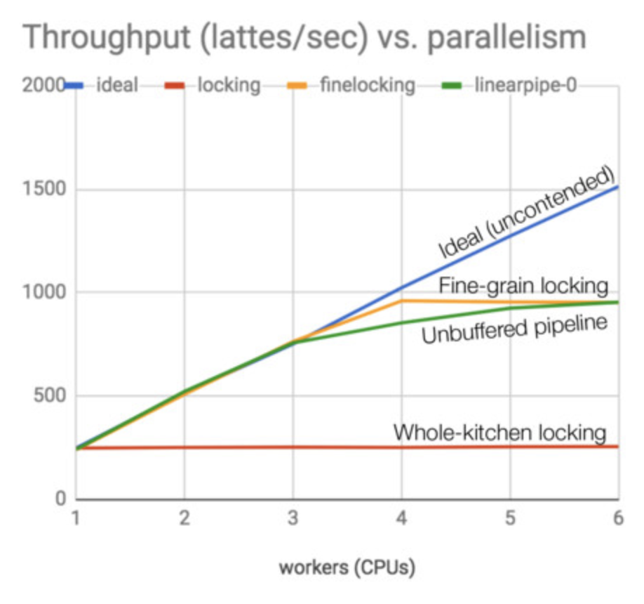

## Sameer Ajmani: Simulating a real-world system in Go

Originalni slideovi s predavanja dostupni [ovdje](https://speakerdeck.com/sajmani/simulating-a-real-world-system-in-go).

Postupak pravljenja napitka se može podijeliti u 4 _stagea_. 



### Mutex lock na cijeli napitak

Ako stavimo jedan lock na cijeli postupak pravljenja napitka tada je pravljenje napitka usko grlo. U svakom trenutku se može raditi **samo na jednom** napitku bez obzira na broj gorutina. Ukupan broj napravljenih napitaka ovisi samo o ukupnom vremenu izvođenja pokusa. Dodavanje gorutina nema utjecaj na konačan ishod jer **sve gorutine čekaju na isti zaključani resurs**.

```
workers: 1 RESULT: 34664 // ukupan broj napitaka ne ovisi o broju gorutina
workers: 2 RESULT: 34783
workers: 3 RESULT: 34326
workers: 4 RESULT: 34537
workers: 5 RESULT: 34455
workers: 6 RESULT: 34237
workers: 7 RESULT: 34396
workers: 8 RESULT: 34064
workers: 9 RESULT: 33561
```

### Mutex lock na svaki stage zasebno

S obzirom da postupak ima 4 _stagea_ moguće je da 4 gorutine istovremeno rade svaka na svom piću ali na drugom _stageu_. U ovakvom se okruženju gorutine **samoinicijativno preslože u pipeline**. Broj pića raste linearno sa brojem dodanih gorutina dok se ne dođe do 4 gorutine. Svaka sljedeća gorutina ima vrlo malen utjecaj na konačan broj proizvedenih napitaka.

```
workers: 1 RESULT: 34276
workers: 2 RESULT: 56473
workers: 3 RESULT: 85185
workers: 4 RESULT: 94028  <-- zasićenje pipelinea
workers: 5 RESULT: 95655
workers: 6 RESULT: 95543
workers: 7 RESULT: 96844
workers: 8 RESULT: 96692
workers: 9 RESULT: 96950
```



### Unbuffered channel

Za svaki _stage_ smo napravili ulazni kanal (na kojem _stage_ primi task) i izlazni kanal (na kojeg _stage_ pošalje rezultat sljedećem _stageu_). Efekt je vrlo sličan pipelineu koji se dogodi sa mutexima. Ipak, rezultat je **nešto lošiji** od mutexa jer svaki _stage_ **mora čekati** da sljedeći _stage_ preuzme task da bi nastavio raditi. U usporedbi sa kafićem to bi značilo da jedan konobar mora držati napitak u ruci dok ga drugi konobar ne preuzme da bi mogao nastaviti raditi na sljedećem napitku.

### Buffered channel

Buffered channel ispravlja nedostatak iz prošlog zadatka tako što omogući _stageu_ da **ostavi rezultat u buffered kanalu** i nastavi raditi na sljedećem zadatku. U kafiću bi buffered channel bio stol na kojeg konobar može ostaviti neki broj (capacity) napitaka dok ga drugi konobar ne uzme. 

```
cap: 0 workers: 1 RESULT: 76132  // unbuffered channel, lošije od mutexa
cap: 1 workers: 1 RESULT: 87744
cap: 2 workers: 1 RESULT: 92097
cap: 3 workers: 1 RESULT: 91921
cap: 4 workers: 1 RESULT: 93854
cap: 5 workers: 1 RESULT: 93732
cap: 6 workers: 1 RESULT: 93975
cap: 7 workers: 1 RESULT: 94527
cap: 8 workers: 1 RESULT: 85576
cap: 9 workers: 1 RESULT: 94764  // buffered channel, slično mutexima
```



